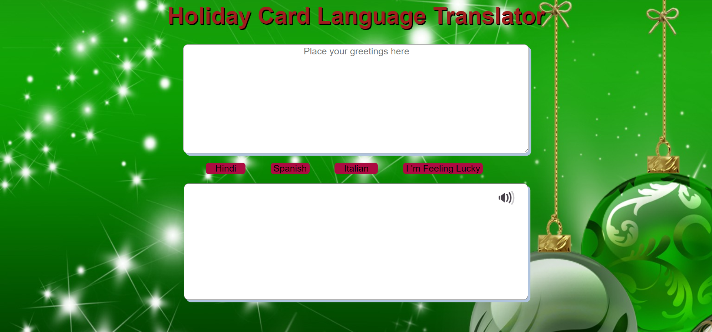

# Holiday Card Launguage Translator

This project represents a limited dictionary and use it to translate a holiday card message from English into Hindi, spanish and italian language. It also allows the translated text to speech. 

# Screenshot


## How to run this project
* Use npm to install http-server in your terminal:
```
npm install -g http-server
```
* Run the server
```
hs -p 9090
```
* Open chrome and navigate to :
```
localhost:9090
```
